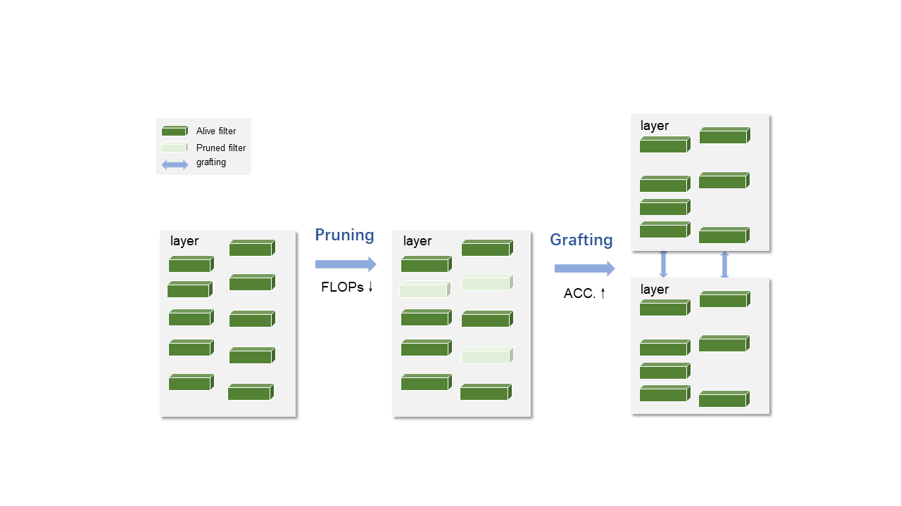

# P&GGD for Deep Neural Networks

## Introduction

This is the PyTorch implementation of our **P&GGD For Fresh Tea Leaves Classification: A Joint-way Optimization Strategy Based on Filter Pruning and Filter Grafting** and related dataset.

## Prerequisites

Python 3.6+

PyTorch 1.0+